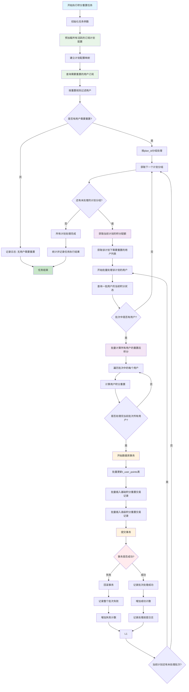

```mermaid
flowchart TD
    A[开始执行积分重置任务] --> B[初始化任务参数]
    
    B --> C[预加载所有活跃的订阅计划配置]
    C --> C1[建立计划配置映射]
    
    C1 --> D[查询需要重置的用户订阅]
    D --> D1[按重置规则过滤用户]
    
    D1 --> E{是否有用户需要重置?}
    E -->|否| F[记录日志: 无用户需要重置]
    F --> Z[任务结束]
    
    E -->|是| G[按plan_id分组处理]
    G --> H[获取下一个计划分组]
    
    H --> I{还有未处理的计划分组?}
    I -->|否| Y[所有计划处理完成]
    Y --> AA[统计并记录任务执行结果]
    AA --> Z
    
    I -->|是| J[获取当前计划的积分配额]
    J --> K[获取该计划下需要重置的用户列表]
    
    K --> L[开始批量处理该计划的用户]
    L --> M[查询一批用户的当前积分状态]
    
    M --> N{批次中是否有用户?}
    N -->|否| H
    N -->|是| O[批量计算所有用户的重置后积分]
    
    O --> P[遍历批次中的每个用户]
    P --> Q[计算用户积分重置]
    
    Q --> R{是否处理完当前批次所有用户?}
    R -->|否| P
    R -->|是| S[开始数据库事务]
    
    S --> T[批量更新t_user_points表]
    T --> U[批量插入基础积分重置交易记录]
    U --> V[批量插入高级积分重置交易记录]
    
    V --> W[提交事务]
    W --> X{事务是否成功?}
    
    X -->|失败| X1[回滚事务]
    X1 --> X2[记录整个批次失败]
    X2 --> X3[增加失败计数]
    X3 --> L1
    
    X -->|成功| X4[记录批次处理成功]
    X4 --> X5[增加成功计数]
    X5 --> X6[记录处理进度日志]
    X6 --> L1
    
    L1 --> L2{当前计划还有未处理批次?}
    L2 -->|是| L
    L2 -->|否| H

    style A fill:#e1f5fe
    style Z fill:#c8e6c9
    style C fill:#e8f5e8
    style D fill:#e8f5e8
    style S fill:#fff3e0
    style W fill:#fff3e0
    style X fill:#ffebee
    style O fill:#f3e5f5
    style J fill:#f3e5f5
```