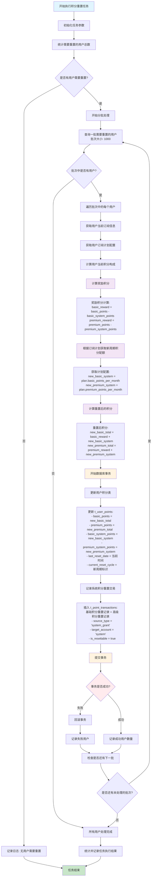

```mermaid
flowchart TD
    A[开始执行积分重置任务] --> B[初始化任务参数]
    B --> C[统计需要重置的用户总数]
    C --> D{是否有用户需要重置?}
    
    D -->|否| E[记录日志: 无用户需要重置]
    E --> Z[任务结束]
    
    D -->|是| F[开始分批处理]
    F --> G[查询一批需要重置的用户<br/>批次大小: 1000]
    
    G --> H{批次中是否有用户?}
    H -->|否| Y[所有用户处理完成]
    Y --> AA[统计并记录任务执行结果]
    AA --> Z
    
    H -->|是| I[遍历批次中的每个用户]
    I --> J[获取用户当前订阅信息]
    J --> K[获取用户订阅计划配置]
    K --> L[计算用户当前积分构成]
    
    L --> M[计算奖励积分]
    M --> N["""
    奖励积分计算:
    basic_reward = basic_points - basic_system_points
    premium_reward = premium_points - premium_system_points
    """]
    
    N --> O[根据订阅计划获取新周期积分配额]
    O --> P["""
    获取计划配置:
    new_basic_system = plan.basic_points_per_month
    new_premium_system = plan.premium_points_per_month
    """]
    
    P --> Q[计算重置后的积分]
    Q --> R["""
    重置后积分:
    new_basic_total = basic_reward + new_basic_system
    new_premium_total = premium_reward + new_premium_system
    """]
    
    R --> S[开始数据库事务]
    S --> T[更新用户积分表]
    T --> U["""
    更新 t_user_points:
    - basic_points = new_basic_total
    - premium_points = new_premium_total  
    - basic_system_points = new_basic_system
    - premium_system_points = new_premium_system
    - last_reset_date = 当前时间
    - current_reset_cycle = 新周期标识
    """]
    
    U --> V[记录系统积分重置交易]
    V --> W["""
    插入 t_point_transactions:
    基础积分重置记录 + 高级积分重置记录
    - source_type = 'system_grant'
    - target_account = 'system'
    - is_resettable = true
    """]
    
    W --> X[提交事务]
    X --> X1{事务是否成功?}
    
    X1 -->|失败| X2[回滚事务]
    X2 --> X3[记录失败用户]
    X3 --> BB[检查是否还有下一批]
    
    X1 -->|成功| X4[记录成功用户数量]
    X4 --> BB
    
    BB --> CC{是否还有未处理的批次?}
    CC -->|是| G
    CC -->|否| Y

    style A fill:#e1f5fe
    style Z fill:#c8e6c9
    style S fill:#fff3e0
    style X fill:#fff3e0
    style X1 fill:#ffebee
    style M fill:#f3e5f5
    style O fill:#f3e5f5
    style Q fill:#f3e5f5
```