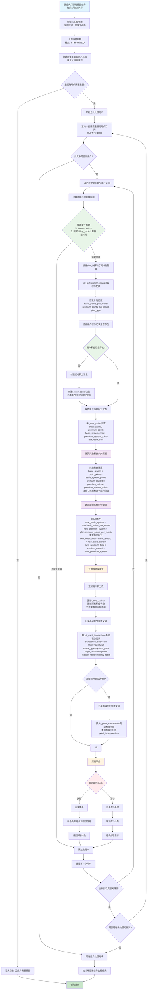

```mermaid
flowchart TD
    A[开始执行积分重置任务<br/>每月1号0点执行] --> B[初始化任务参数<br/>当前时间、批次大小等]
    B --> C[计算当前日期<br/>格式: YYYY-MM-DD]
    C --> D[统计需要重置的用户总数<br/>基于订阅表查询]
    
    D --> E{是否有用户需要重置?}
    E -->|否| F[记录日志: 无用户需要重置]
    F --> Z[任务结束]
    
    E -->|是| G[开始分批处理用户]
    G --> H[查询一批需要重置的用户订阅<br/>批次大小: 1000]
    
    H --> I{批次中是否有用户?}
    I -->|否| Y[所有用户处理完成]
    Y --> AA[统计并记录任务执行结果]
    AA --> Z
    
    I -->|是| J[遍历批次中的每个用户订阅]
    J --> K[计算该用户的重置周期]
    K --> L{重置条件判断<br/>1. status = active<br/>2. 根据billing_cycle计算重置时间}
    
    L -->|不需要重置| BB[跳过此用户]
    L -->|需要重置| M[根据plan_id获取订阅计划配置]
    
    M --> N[从t_subscription_plans获取积分配额]
    N --> O[获取计划配置<br/>basic_points_per_month<br/>premium_points_per_month<br/>plan_type]
    
    O --> P[检查用户积分记录是否存在]
    P --> Q{用户积分记录存在?}
    
    Q -->|否| R[创建初始积分记录]
    R --> R1[创建t_user_points记录<br/>所有积分字段初始化为0]
    R1 --> S
    
    Q -->|是| S[获取用户当前积分状态]
    S --> T[从t_user_points获取<br/>basic_points, premium_points<br/>basic_system_points, premium_system_points<br/>last_reset_date]
    
    T --> U[计算奖励积分永久保留]
    U --> V[奖励积分计算<br/>basic_reward = basic_points - basic_system_points<br/>premium_reward = premium_points - premium_system_points<br/>注意：奖励积分不能为负数]
    
    V --> W[计算新的系统积分配额]
    W --> X[新系统积分<br/>new_basic_system = plan.basic_points_per_month<br/>new_premium_system = plan.premium_points_per_month<br/>重置后总积分<br/>new_basic_total = basic_reward + new_basic_system<br/>new_premium_total = premium_reward + new_premium_system]
    
    X --> Y1[开始数据库事务]
    Y1 --> Y2[更新用户积分表]
    Y2 --> Y3[更新t_user_points<br/>更新所有积分字段<br/>更新重置时间和周期]
    
    Y3 --> Y4[记录基础积分重置交易]
    Y4 --> Y5[插入t_point_transactions基础积分记录<br/>transaction_type=earn<br/>point_type=basic<br/>source_type=system_grant<br/>target_account=system<br/>feature_name=monthly_reset]
    
    Y5 --> Y6{高级积分是否大于0?}
    Y6 -->|是| Y7[记录高级积分重置交易]
    Y6 -->|否| Y9
    
    Y7 --> Y8[插入t_point_transactions高级积分记录<br/>类似基础积分但point_type=premium]
    Y8 --> Y9
    
    Y9 --> Y10[提交事务]
    Y10 --> Y11{事务是否成功?}
    
    Y11 -->|失败| Y12[回滚事务]
    Y12 --> Y13[记录失败用户和错误信息]
    Y13 --> Y14[增加失败计数]
    Y14 --> BB
    
    Y11 -->|成功| Y15[记录成功处理]
    Y15 --> Y16[增加成功计数]
    Y16 --> Y17[记录处理日志]
    Y17 --> BB
    
    BB --> CC[处理下一个用户]
    CC --> DD{当前批次是否处理完?}
    
    DD -->|否| J
    DD -->|是| EE{是否还有未处理的批次?}
    EE -->|是| H
    EE -->|否| Y

    style A fill:#e1f5fe
    style Z fill:#c8e6c9
    style Y1 fill:#fff3e0
    style Y10 fill:#fff3e0
    style Y11 fill:#ffebee
    style U fill:#f3e5f5
    style W fill:#f3e5f5
    style L fill:#e8f5e8
    style Q fill:#e8f5e8
```