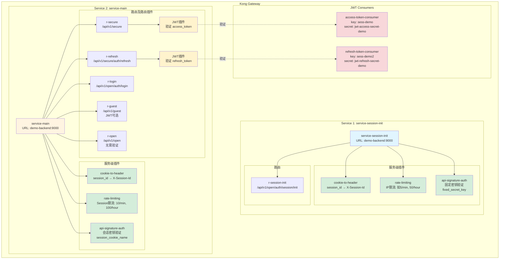

```mermaid

graph TB
    subgraph "Kong Gateway"
        subgraph "Service 1: service-session-init"
            S1[service-session-init<br/>URL: demo-backend:9000]
            
            subgraph "服务级插件"
                S1P1[cookie-to-header<br/>session_id → X-Session-Id]
                S1P2[rate-limiting<br/>IP限流: 如5/min, 50/hour]
                S1P3[api-signature-auth<br/>固定密钥验证<br/>fixed_secret_key]
            end
            
            subgraph "路由"
                R1[r-session-init<br/>/api/v1/open/auth/session/init]
            end
            
            S1 --> S1P1
            S1 --> S1P2
            S1 --> S1P3
            S1 --> R1
        end
        
        subgraph "Service 2: service-main"
            S2[service-main<br/>URL: demo-backend:9000]
            
            subgraph "服务级插件 "
                S2P1[cookie-to-header<br/>session_id → X-Session-Id]
                S2P2[rate-limiting<br/>Session限流: 10/min, 100/hour]
                S2P3[api-signature-auth<br/>会话密钥验证<br/>session_cookie_name]
            end
            
            subgraph "路由及路由插件"
                R2[r-login<br/>/api/v1/open/auth/login]
                
                R3[r-refresh<br/>/api/v1/secure/auth/refresh]
                R3P1[JWT插件<br/>验证 refresh_token]
                
                R4[r-secure<br/>/api/v1/secure]
                R4P1[JWT插件<br/>验证 access_token]
                
                R5[r-guest<br/>/api/v1/guest<br/>JWT可选]
                
                R6[r-open<br/>/api/v1/open<br/>无需验证]
                
                R3 --> R3P1
                R4 --> R4P1
            end
            
            S2 --> S2P1
            S2 --> S2P2
            S2 --> S2P3
            S2 --> R2
            S2 --> R3
            S2 --> R4
            S2 --> R5
            S2 --> R6
        end
        
        subgraph "JWT Consumers"
            C1[access-token-consumer<br/>key: sess-demo<br/>secret: jwt-access-secret-demo]
            C2[refresh-token-consumer<br/>key: sess-demo2<br/>secret: jwt-refresh-secret-demo]
        end
        
        R3P1 -.验证.-> C2
        R4P1 -.验证.-> C1
    end
    
    style S1 fill:#e1f5ff
    style S2 fill:#fff4e1
    style S1P1 fill:#d4edda
    style S1P2 fill:#d4edda
    style S1P3 fill:#d4edda
    style S2P1 fill:#d4edda
    style S2P2 fill:#d4edda
    style S2P3 fill:#d4edda
    style R3P1 fill:#fff3cd
    style R4P1 fill:#fff3cd
    style C1 fill:#f8d7da
    style C2 fill:#f8d7da

```