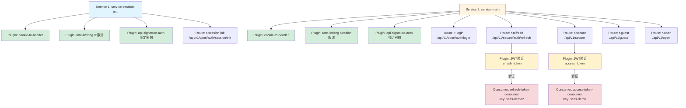

```mermaid
graph TB
    S1[Service 1: service-session-init]
    S1P1[Plugin: cookie-to-header]
    S1P2[Plugin: rate-limiting IP限流]
    S1P3[Plugin: api-signature-auth 固定密钥]
    R1[Route: r-session-init<br/>/api/v1/open/auth/session/init]
    
    S1 --> S1P1
    S1 --> S1P2
    S1 --> S1P3
    S1 --> R1
    
    S2[Service 2: service-main]
    S2P1[Plugin: cookie-to-header]
    S2P2[Plugin: rate-limiting Session限流]
    S2P3[Plugin: api-signature-auth 会话密钥]
    
    R2[Route: r-login<br/>/api/v1/open/auth/login]
    R3[Route: r-refresh<br/>/api/v1/secure/auth/refresh]
    R3P[Plugin: JWT验证refresh_token]
    R4[Route: r-secure<br/>/api/v1/secure]
    R4P[Plugin: JWT验证access_token]
    R5[Route: r-guest<br/>/api/v1/guest]
    R6[Route: r-open<br/>/api/v1/open]
    
    S2 --> S2P1
    S2 --> S2P2
    S2 --> S2P3
    S2 --> R2
    S2 --> R3
    S2 --> R4
    S2 --> R5
    S2 --> R6
    
    R3 --> R3P
    R4 --> R4P
    
    C1[Consumer: access-token-consumer<br/>key: sess-demo]
    C2[Consumer: refresh-token-consumer<br/>key: sess-demo2]
    
    R3P -.验证.-> C2
    R4P -.验证.-> C1
    
    style S1 fill:#e1f5ff
    style S2 fill:#fff4e1
    style S1P1 fill:#d4edda
    style S1P2 fill:#d4edda
    style S1P3 fill:#d4edda
    style S2P1 fill:#d4edda
    style S2P2 fill:#d4edda
    style S2P3 fill:#d4edda
    style R3P fill:#fff3cd
    style R4P fill:#fff3cd
    style C1 fill:#f8d7da
    style C2 fill:#f8d7da
```