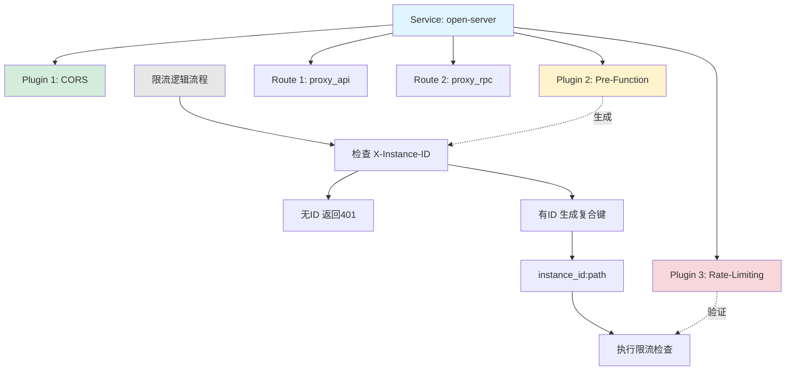

```mermaid
graph TB
    S1[Service: open-server]
    
    S1P1[Plugin 1: CORS]
    S1P2[Plugin 2: Pre-Function]
    S1P3[Plugin 3: Rate-Limiting]
    
    R1[Route 1: proxy_api]
    R2[Route 2: proxy_rpc]
    
    S1 --> S1P1
    S1 --> S1P2
    S1 --> S1P3
    S1 --> R1
    S1 --> R2
    
    Logic[限流逻辑流程]
    L1[检查 X-Instance-ID]
    L2[无ID 返回401]
    L3[有ID 生成复合键]
    L4[instance_id:path]
    L5[执行限流检查]
    
    Logic --> L1
    L1 --> L2
    L1 --> L3
    L3 --> L4
    L4 --> L5
    
    S1P2 -.生成.-> L1
    S1P3 -.验证.-> L5
    
    style S1 fill:#e1f5ff
    style S1P1 fill:#d4edda
    style S1P2 fill:#fff3cd
    style S1P3 fill:#f8d7da
    style Logic fill:#e7e7e7
```