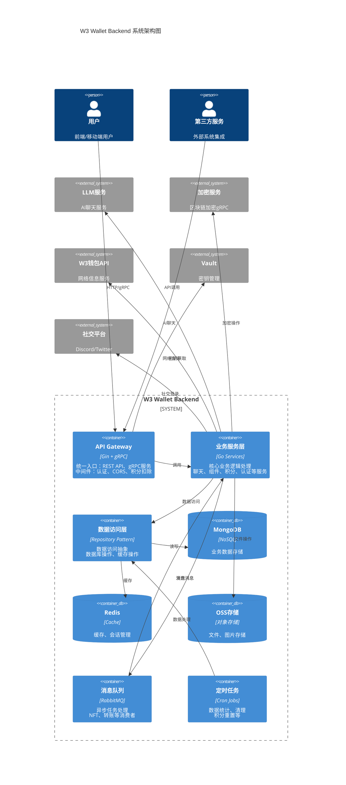

```mermaid
C4Context
    title W3 Wallet Backend 系统架构图

    Person(user, "用户", "前端/移动端用户")
    Person(thirdParty, "第三方服务", "外部系统集成")

    System_Boundary(backend, "W3 Wallet Backend") {
        Container(api, "API Gateway", "Gin + gRPC", "统一入口：REST API、gRPC服务<br/>中间件：认证、CORS、积分扣除")
        
        Container(services, "业务服务层", "Go Services", "核心业务逻辑处理<br/>聊天、组件、积分、认证等服务")
        
        Container(repo, "数据访问层", "Repository Pattern", "数据访问抽象<br/>数据库操作、缓存操作")
        
        ContainerDb(mongodb, "MongoDB", "NoSQL", "业务数据存储")
        ContainerDb(redis, "Redis", "Cache", "缓存、会话管理")
        ContainerDb(oss, "OSS存储", "对象存储", "文件、图片存储")
        
        Container(mq, "消息队列", "RabbitMQ", "异步任务处理<br/>NFT、转账等消费者")
        
        Container(tasks, "定时任务", "Cron Jobs", "数据统计、清理<br/>积分重置等")
    }

    System_Ext(llm, "LLM服务", "AI聊天服务")
    System_Ext(crypto, "加密服务", "区块链加密gRPC")
    System_Ext(wallet, "W3钱包API", "网络信息服务")
    System_Ext(vault, "Vault", "密钥管理")
    System_Ext(social, "社交平台", "Discord/Twitter")

    Rel(user, api, "HTTP/gRPC")
    Rel(thirdParty, api, "API调用")
    
    Rel(api, services, "调用")
    Rel(services, repo, "数据访问")
    
    Rel(repo, mongodb, "读写")
    Rel(repo, redis, "缓存")
    Rel(services, oss, "文件操作")
    
    Rel(services, mq, "发送消息")
    Rel(mq, services, "消费消息")
    
    Rel(tasks, repo, "数据处理")
    
    Rel(services, llm, "AI聊天")
    Rel(services, crypto, "加密操作")
    Rel(services, wallet, "网络查询")
    Rel(api, vault, "密钥获取")
    Rel(services, social, "社交登录")
```