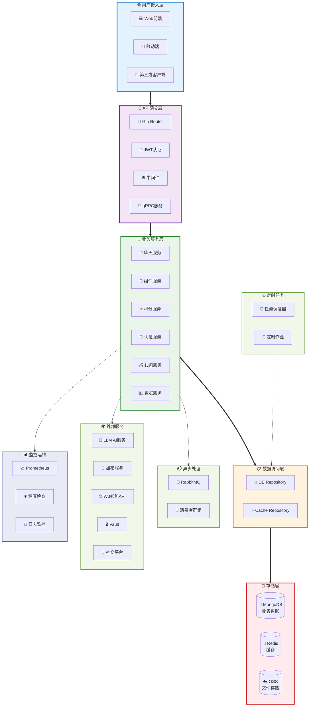

```mermaid
graph TB
    %% 分层架构
    subgraph layer1 ["🌐 用户接入层"]
        direction LR
        A1["💻 Web前端"] 
        A2["📱 移动端"]
        A3["🔧 第三方客户端"]
    end
    
    subgraph layer2 ["🚪 API网关层"]
        direction LR
        B1["🎯 Gin Router"]
        B2["🔐 JWT认证"] 
        B3["⚙️ 中间件"]
        B4["🔗 gRPC服务"]
    end
    
    subgraph layer3 ["💼 业务服务层"]
        direction LR
        C1["💬 聊天服务"]
        C2["🧩 组件服务"]
        C3["⭐ 积分服务"]
        C4["🔑 认证服务"]
        C5["💰 钱包服务"]
        C6["📊 数据服务"]
    end
    
    subgraph layer4 ["📋 数据访问层"]
        direction LR
        D1["🗄️ DB Repository"]
        D2["⚡ Cache Repository"]
    end
    
    subgraph layer5 ["💾 存储层"]
        direction LR
        E1[("🍃 MongoDB<br/>业务数据")]
        E2[("🔴 Redis<br/>缓存")]
        E3[("☁️ OSS<br/>文件存储")]
    end
    
    %% 侧边组件
    subgraph side1 ["📬 异步处理"]
        F1["🐰 RabbitMQ"]
        F2["🔄 消费者群组"]
    end
    
    subgraph side2 ["⏰ 定时任务"]
        G1["📅 任务调度器"]
        G2["🔧 定时作业"]
    end
    
    subgraph side3 ["🌍 外部服务"]
        H1["🤖 LLM AI服务"]
        H2["🔐 加密服务"]
        H3["🌐 W3钱包API"]
        H4["🔒 Vault"]
        H5["📲 社交平台"]
    end
    
    subgraph side4 ["📊 监控运维"]
        I1["📈 Prometheus"]
        I2["💗 健康检查"]
        I3["📝 日志监控"]
    end
    
    %% 连接关系
    layer1 ==> layer2
    layer2 ==> layer3
    layer3 ==> layer4
    layer4 ==> layer5
    
    layer3 -.-> side1
    layer3 -.-> side3
    side2 -.-> layer4
    layer3 -.-> side4
    
    %% 样式
    classDef userLayer fill:#e3f2fd,stroke:#1976d2,stroke-width:3px
    classDef gatewayLayer fill:#f3e5f5,stroke:#7b1fa2,stroke-width:3px
    classDef serviceLayer fill:#e8f5e8,stroke:#388e3c,stroke-width:3px
    classDef dataLayer fill:#fff3e0,stroke:#f57c00,stroke-width:3px
    classDef storageLayer fill:#ffebee,stroke:#d32f2f,stroke-width:3px
    classDef sideComponent fill:#f1f8e9,stroke:#689f38,stroke-width:2px
    classDef monitor fill:#e8eaf6,stroke:#3f51b5,stroke-width:2px
    
    class layer1 userLayer
    class layer2 gatewayLayer
    class layer3 serviceLayer
    class layer4 dataLayer
    class layer5 storageLayer
    class side1,side2,side3 sideComponent
    class side4 monitor
```