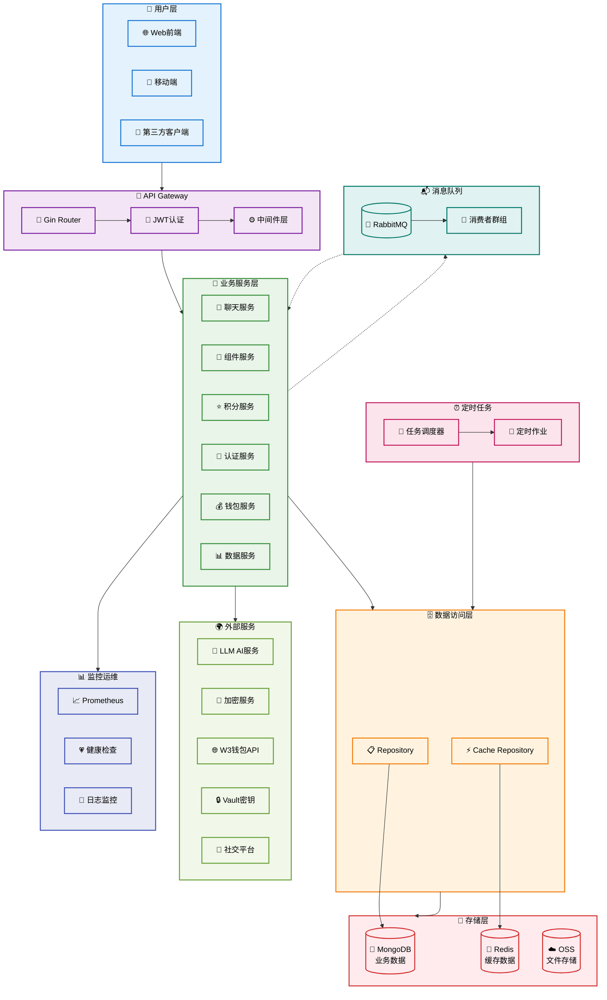

```mermaid
flowchart TD
    %% 用户层
    subgraph users ["👥 用户层"]
        web["🌐 Web前端"]
        mobile["📱 移动端"]
        api_client["🔧 第三方客户端"]
    end

    %% API网关层
    subgraph gateway ["🚪 API Gateway"]
        router["🎯 Gin Router"]
        auth["🔐 JWT认证"]
        middleware["⚙️ 中间件层"]
    end

    %% 业务服务层
    subgraph services ["💼 业务服务层"]
        chat["💬 聊天服务"]
        component["🧩 组件服务"]
        points["⭐ 积分服务"]
        auth_svc["🔑 认证服务"]
        wallet_svc["💰 钱包服务"]
        data_svc["📊 数据服务"]
    end

    %% 数据层
    subgraph data ["🗄️ 数据访问层"]
        repo["📋 Repository"]
        cache_repo["⚡ Cache Repository"]
    end

    %% 存储层
    subgraph storage ["💾 存储层"]
        mongo[("🍃 MongoDB<br/>业务数据")]
        redis[("🔴 Redis<br/>缓存数据")]
        oss[("☁️ OSS<br/>文件存储")]
    end

    %% 消息队列
    subgraph queue ["📬 消息队列"]
        rabbitmq[("🐰 RabbitMQ")]
        consumers["🔄 消费者群组"]
    end

    %% 定时任务
    subgraph cron ["⏰ 定时任务"]
        scheduler["📅 任务调度器"]
        jobs["🔧 定时作业"]
    end

    %% 外部服务
    subgraph external ["🌍 外部服务"]
        llm["🤖 LLM AI服务"]
        crypto["🔐 加密服务"]
        w3api["🌐 W3钱包API"]
        vault["🔒 Vault密钥"]
        social["📲 社交平台"]
    end

    %% 监控
    subgraph monitor ["📊 监控运维"]
        metrics["📈 Prometheus"]
        health["💗 健康检查"]
        logs["📝 日志监控"]
    end

    %% 连接关系
    users --> gateway
    gateway --> services
    services --> data
    data --> storage
    services -.-> queue
    queue -.-> services
    services --> external
    cron --> data
    services --> monitor

    %% 内部连接
    router --> auth
    auth --> middleware
    repo --> mongo
    cache_repo --> redis
    rabbitmq --> consumers
    scheduler --> jobs

    %% 样式定义
    classDef userStyle fill:#e3f2fd,stroke:#1976d2,stroke-width:2px,color:#000
    classDef gatewayStyle fill:#f3e5f5,stroke:#7b1fa2,stroke-width:2px,color:#000
    classDef serviceStyle fill:#e8f5e8,stroke:#388e3c,stroke-width:2px,color:#000
    classDef dataStyle fill:#fff3e0,stroke:#f57c00,stroke-width:2px,color:#000
    classDef storageStyle fill:#ffebee,stroke:#d32f2f,stroke-width:2px,color:#000
    classDef queueStyle fill:#e0f2f1,stroke:#00796b,stroke-width:2px,color:#000
    classDef cronStyle fill:#fce4ec,stroke:#c2185b,stroke-width:2px,color:#000
    classDef externalStyle fill:#f1f8e9,stroke:#689f38,stroke-width:2px,color:#000
    classDef monitorStyle fill:#e8eaf6,stroke:#3f51b5,stroke-width:2px,color:#000

    %% 应用样式
    class users,web,mobile,api_client userStyle
    class gateway,router,auth,middleware gatewayStyle
    class services,chat,component,points,auth_svc,wallet_svc,data_svc serviceStyle
    class data,repo,cache_repo dataStyle
    class storage,mongo,redis,oss storageStyle
    class queue,rabbitmq,consumers queueStyle
    class cron,scheduler,jobs cronStyle
    class external,llm,crypto,w3api,vault,social externalStyle
    class monitor,metrics,health,logs monitorStyle
```