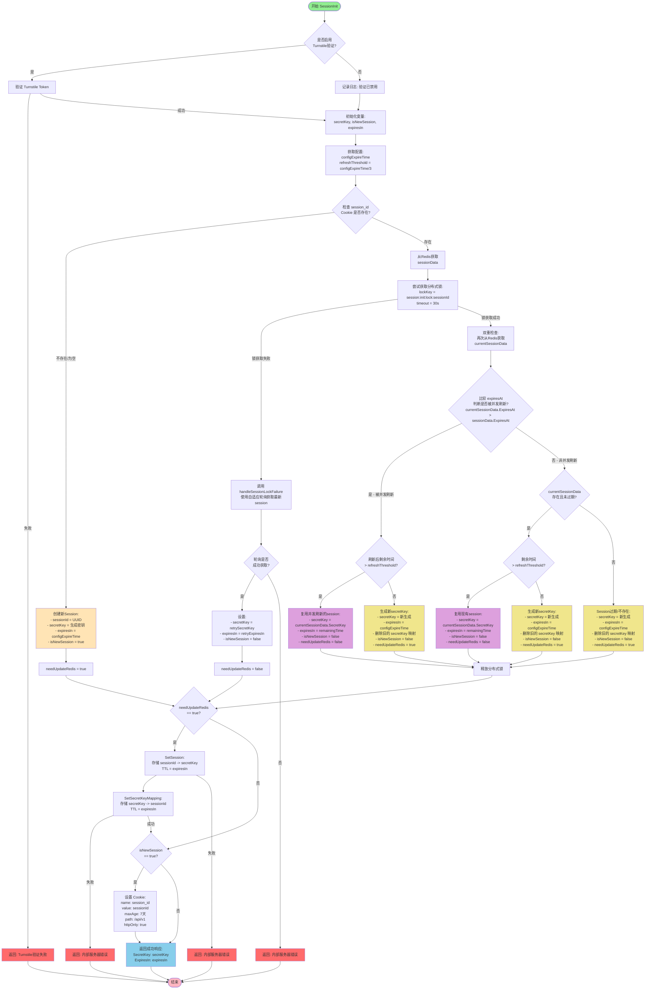

```mermaid
flowchart TD
    Start([开始 SessionInit]) --> CheckTurnstile{是否启用<br/>Turnstile验证?}
    
    CheckTurnstile -->|是| VerifyTurnstile[验证 Turnstile Token]
    CheckTurnstile -->|否| LogDisabled[记录日志: 验证已禁用]
    
    VerifyTurnstile -->|失败| ReturnError1[返回: Turnstile验证失败]
    VerifyTurnstile -->|成功| InitVariables
    LogDisabled --> InitVariables
    
    InitVariables[初始化变量:<br/>secretKey, isNewSession, expiresIn] --> GetConfig[获取配置:<br/>configExpireTime<br/>refreshThreshold = configExpireTime/3]
    
    GetConfig --> CheckCookie{检查 session_id<br/>Cookie 是否存在?}
    
    CheckCookie -->|不存在/为空| CreateNew[创建新Session:<br/>- sessionId = UUID<br/>- secretKey = 生成密钥<br/>- expiresIn = configExpireTime<br/>- isNewSession = true]
    CreateNew --> NeedUpdateRedis
    
    CheckCookie -->|存在| GetSession[从Redis获取<br/>sessionData]
    GetSession --> AcquireLock[尝试获取分布式锁:<br/>lockKey = session:init:lock:sessionId<br/>timeout = 30s]
    
    AcquireLock -->|锁获取失败| HandleLockFailure[调用 handleSessionLockFailure<br/>使用自适应轮询获取最新session]
    HandleLockFailure --> CheckRetry{轮询是否<br/>成功获取?}
    CheckRetry -->|是| SetRetryValues[设置:<br/>- secretKey = retrySecretKey<br/>- expiresIn = retryExpiresIn<br/>- isNewSession = false]
    CheckRetry -->|否| ReturnError2[返回: 内部服务器错误]
    SetRetryValues --> SkipRedisUpdate[needUpdateRedis = false]
    SkipRedisUpdate --> CheckNeedUpdate
    
    AcquireLock -->|锁获取成功| DoubleCheck[双重检查:<br/>再次从Redis获取<br/>currentSessionData]
    
    DoubleCheck --> CompareExpiry{比较 expiresAt<br/>判断是否被并发刷新?<br/>currentSessionData.ExpiresAt > <br/>sessionData.ExpiresAt}
    
    CompareExpiry -->|是 - 被并发刷新| CheckRefreshedTime{刷新后剩余时间<br/>> refreshThreshold?}
    
    CheckRefreshedTime -->|是| ReuseRefreshed[复用并发刷新的session:<br/>- secretKey = currentSessionData.SecretKey<br/>- expiresIn = remainingTime<br/>- isNewSession = false<br/>- needUpdateRedis = false]
    
    CheckRefreshedTime -->|否| RegenerateAfterRefresh[生成新secretKey:<br/>- secretKey = 新生成<br/>- expiresIn = configExpireTime<br/>- 删除旧的 secretKey 映射<br/>- isNewSession = false<br/>- needUpdateRedis = true]
    
    CompareExpiry -->|否 - 非并发刷新| CheckExists{currentSessionData<br/>存在且未过期?}
    
    CheckExists -->|是| CheckRemaining{剩余时间<br/>> refreshThreshold?}
    
    CheckRemaining -->|是| ReuseExisting[复用现有session:<br/>- secretKey = currentSessionData.SecretKey<br/>- expiresIn = remainingTime<br/>- isNewSession = false<br/>- needUpdateRedis = false]
    
    CheckRemaining -->|否| RegenerateKey[生成新secretKey:<br/>- secretKey = 新生成<br/>- expiresIn = configExpireTime<br/>- 删除旧的 secretKey 映射<br/>- isNewSession = false<br/>- needUpdateRedis = true]
    
    CheckExists -->|否| RegenerateExpired[Session过期/不存在:<br/>- secretKey = 新生成<br/>- expiresIn = configExpireTime<br/>- 删除旧的 secretKey 映射<br/>- isNewSession = false<br/>- needUpdateRedis = true]
    
    ReuseRefreshed --> ReleaseLock1[释放分布式锁]
    RegenerateAfterRefresh --> ReleaseLock1
    ReuseExisting --> ReleaseLock1
    RegenerateKey --> ReleaseLock1
    RegenerateExpired --> ReleaseLock1
    
    ReleaseLock1 --> CheckNeedUpdate
    
    NeedUpdateRedis[needUpdateRedis = true] --> CheckNeedUpdate
    
    CheckNeedUpdate{needUpdateRedis<br/>== true?}
    
    CheckNeedUpdate -->|是| UpdateSession[SetSession:<br/>存储 sessionId -> secretKey<br/>TTL = expiresIn]
    
    UpdateSession --> UpdateMapping[SetSecretKeyMapping:<br/>存储 secretKey -> sessionId<br/>TTL = expiresIn]
    
    UpdateMapping -->|失败| ReturnError3[返回: 内部服务器错误]
    UpdateSession -->|失败| ReturnError4[返回: 内部服务器错误]
    
    UpdateMapping -->|成功| CheckIsNew
    CheckNeedUpdate -->|否| CheckIsNew
    
    CheckIsNew{isNewSession<br/>== true?}
    
    CheckIsNew -->|是| SetCookie[设置 Cookie:<br/>name: session_id<br/>value: sessionId<br/>maxAge: 7天<br/>path: /api/v1<br/>httpOnly: true]
    
    CheckIsNew -->|否| ReturnSuccess
    SetCookie --> ReturnSuccess
    
    ReturnSuccess[返回成功响应:<br/>SecretKey: secretKey<br/>ExpiresIn: expiresIn]
    
    ReturnSuccess --> End([结束])
    ReturnError1 --> End
    ReturnError2 --> End
    ReturnError3 --> End
    ReturnError4 --> End
    
    style Start fill:#90EE90
    style End fill:#FFB6C1
    style ReturnError1 fill:#FF6B6B
    style ReturnError2 fill:#FF6B6B
    style ReturnError3 fill:#FF6B6B
    style ReturnError4 fill:#FF6B6B
    style ReturnSuccess fill:#87CEEB
    style CreateNew fill:#FFE4B5
    style ReuseRefreshed fill:#DDA0DD
    style ReuseExisting fill:#DDA0DD
    style RegenerateKey fill:#F0E68C
    style RegenerateExpired fill:#F0E68C
    style RegenerateAfterRefresh fill:#F0E68C
```