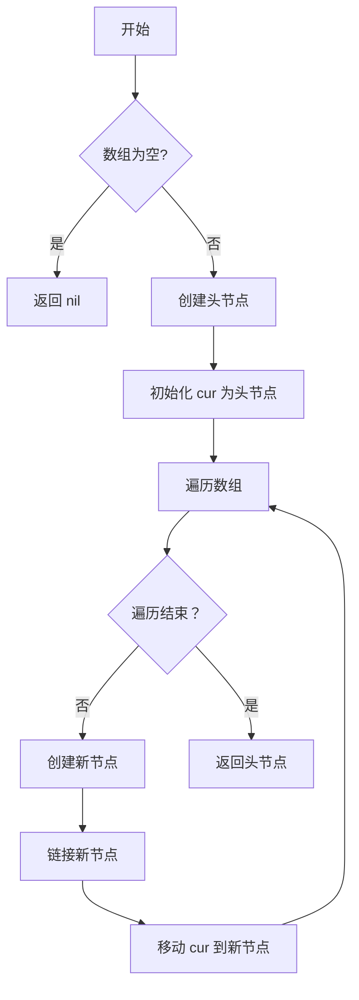

```mermaid
flowchart TD
    A[开始] --> B{数组为空?}
    B -->|是| C[返回 nil]
    B -->|否| D[创建头节点]
    D --> E[初始化 cur 为头节点]
    E --> F[遍历数组]
    F --> G{遍历结束？}
    G -->|否| H[创建新节点]
    H --> I[链接新节点]
    I --> J[移动 cur 到新节点]
    J --> F
    G -->|是| K[返回头节点]

```