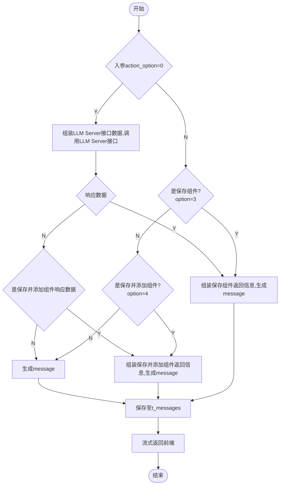

```mermaid
flowchart TD
    A([开始]) --> B{入参action_option=0}
    B -- Y --> C[组装LLM Server接口数据,调用LLM Server接口]
    C --> E{响应数据}
    B -- N --> D{是保存组件? \n option=3}
    E -- N --> L{是保存并添加组件响应数据}
    E -- Y --> F[组装保存组件返回信息,生成message]
    
    L -- N --> R[生成message]
    R --> G
    L -- Y --> K
    D -- Y --> F
    D -- N --> J{是保存并添加组件? \n option=4}
    J -- Y --> K[组装保存并添加组件返回信息,生成message]
    K --> G
    J -- N --> R
    F --> G[保存至t_messages]
    G --> H[流式返回前端]
    H --> I([结束])
```