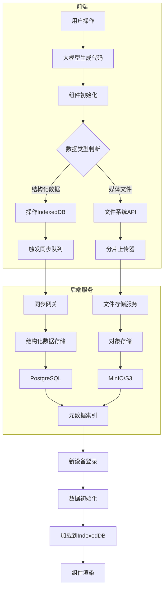

```mermaid
graph TD
    subgraph 前端
        A[用户操作] --> B[大模型生成代码]
        B --> C[组件初始化]
        C --> D{数据类型判断}
        D -->|结构化数据| E[操作IndexedDB]
        D -->|媒体文件| F[文件系统API]
        E --> G[触发同步队列]
        F --> H[分片上传器]
    end

    subgraph 后端服务
        G --> I[同步网关]
        H --> J[文件存储服务]
        I --> K[结构化数据存储]
        J --> L[对象存储]
        K --> M[PostgreSQL]
        L --> N[MinIO/S3]
        M & N --> O[元数据索引]
    end

    O --> P[新设备登录]
    P --> Q[数据初始化]
    Q --> R[加载到IndexedDB]
    R --> S[组件渲染]
```