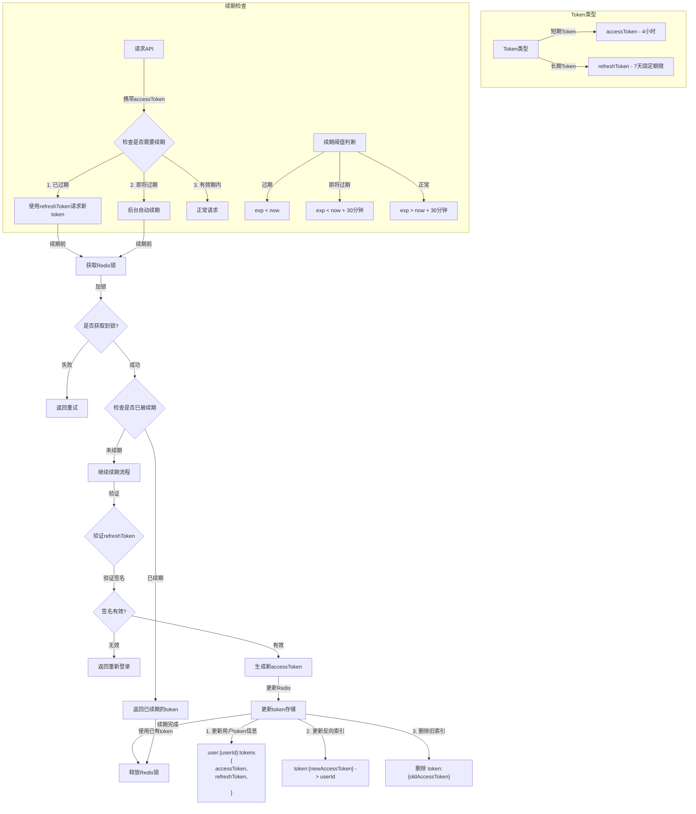

```mermaid
flowchart TD
    subgraph Token类型
        A[Token类型] -->|短期Token| B[accessToken - 4小时]
        A -->|长期Token| C[refreshToken - 7天固定期限]
    end

    subgraph 续期检查
        F[请求API] -->|携带accessToken| G{检查是否需要续期}
        G -->|1. 已过期| H[使用refreshToken请求新token]
        G -->|2. 即将过期| I[后台自动续期]
        G -->|3. 有效期内| J[正常请求]
        
        %% 续期阈值判断
        K[续期阈值判断]
        K -->|过期| L[exp < now]
        K -->|即将过期| M[exp < now + 30分钟]
        K -->|正常| N[exp > now + 30分钟]
    end

    %% 并发控制和续期流程
    H & I -->|续期前| LC[获取Redis锁]
    LC -->|加锁| LD{是否获取到锁?}
    LD -->|失败| LE[返回重试]
    LD -->|成功| LF{检查是否已被续期}
    LF -->|已续期| LG[返回已续期的token]
    LF -->|未续期| LH[继续续期流程]   

    %% Token验证和生成
    LH -->|验证| O{验证refreshToken}
    O -->|验证签名| P{签名有效?}
    P -->|无效| Q1[返回重新登录]
    P -->|有效| V[生成新accessToken]
    
    %% Redis更新
    V -->|更新Redis| X[更新token存储]
    X -->|1. 更新用户token信息| Y["user:{userId}:tokens 
    {
        accessToken,
        refreshToken,
    
    }"]
    X -->|2. 更新反向索引| Z["token:{newAccessToken} -> userId"]
    X -->|3. 删除旧索引| AA["删除 token:{oldAccessToken}"]

    %% 释放锁
    X -->|续期完成| LI[释放Redis锁]
    LG -->|使用已有token| LI
```