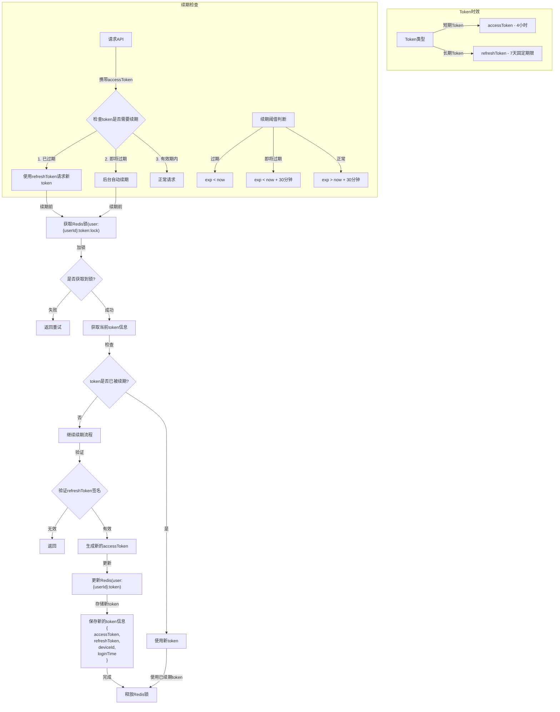

```mermaid
flowchart TD
    subgraph Token时效
        A[Token类型] -->|短期Token| B[accessToken - 4小时]
        A -->|长期Token| C[refreshToken - 7天固定期限]
    end

    subgraph 续期检查
        F[请求API] -->|携带accessToken| G{检查token是否需要续期}
        G -->|1. 已过期| H[使用refreshToken请求新token]
        G -->|2. 即将过期| I[后台自动续期]
        G -->|3. 有效期内| J[正常请求]
        
        %% 续期阈值判断
        K[续期阈值判断]
        K -->|过期| L[exp < now]
        K -->|即将过期| M[exp < now + 30分钟]
        K -->|正常| N[exp > now + 30分钟]
    end

    %% 并发控制和续期流程
    H & I -->|续期前| LC["获取Redis锁(user:{userId}:token:lock)"]
    LC -->|加锁| LD{是否获取到锁?}
    LD -->|失败| LE[返回重试]
    LD -->|成功| LF[获取当前token信息]
    LF -->|检查| LG{token是否已被续期?}
    LG -->|是| LH[使用新token]
    LG -->|否| LI[继续续期流程]   

    %% Token验证和生成
    LI -->|验证| O{验证refreshToken签名}
    O -->|无效| P[返回]
    O -->|有效| Q[生成新的accessToken]
    
    %% 更新Redis存储
    Q -->|更新| R["更新Redis(user:{userId}:token)"]
    R -->|存储新token| S["保存新的token信息 
    {
        accessToken,
        refreshToken,
        deviceId,
        loginTime
    }"]

    %% 释放锁
    S -->|完成| T[释放Redis锁]
    LH -->|使用已续期token| T
```